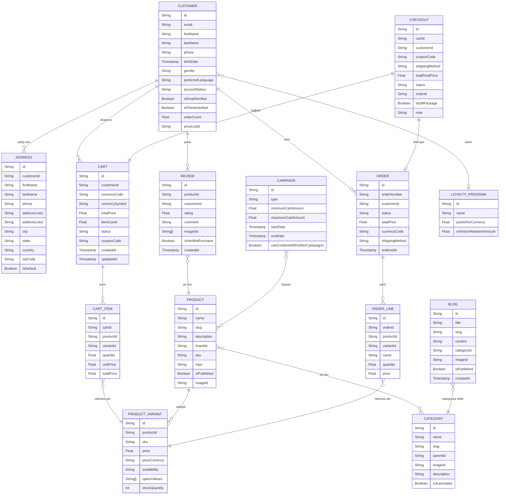
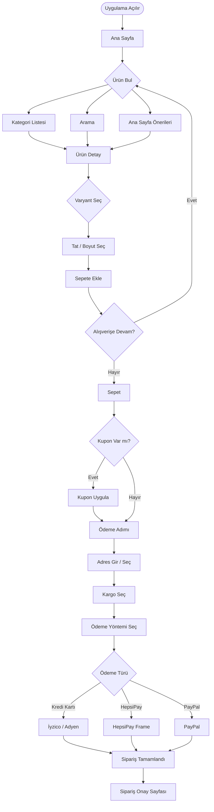
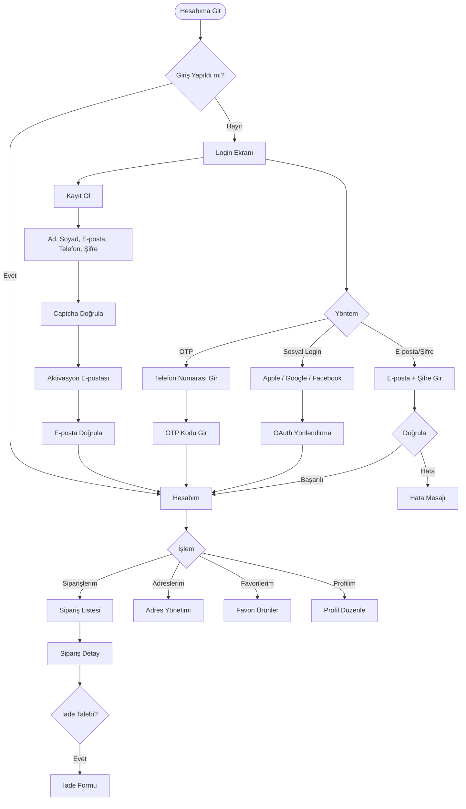
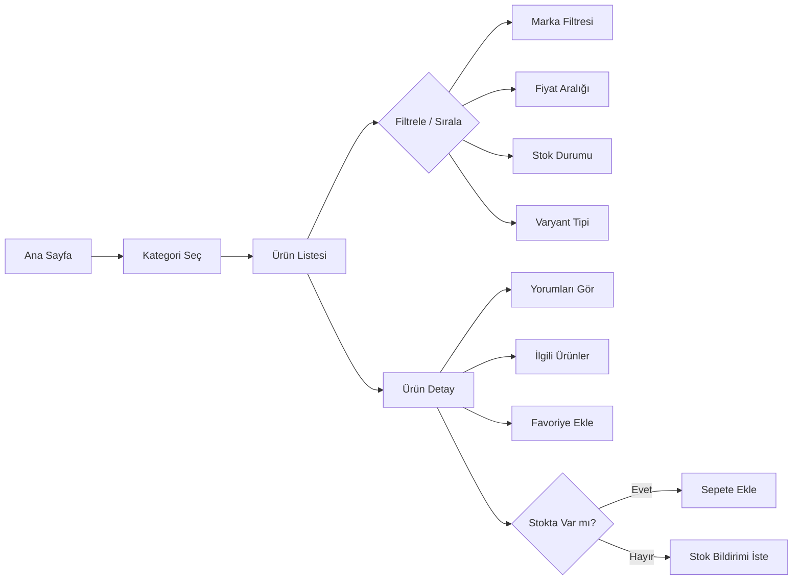

# ProteinOcean Web Sitesi Analiz Raporu

> **Analiz Tarihi:** 4 Mart 2026
> **Hedef:** iOS Native Uygulama Dönüşümü
> **Analiz Yöntemi:** Pasif analiz (robots.txt, sitemap, HTML kaynak, Schema.org, GraphQL introspection)

---

## 1. Genel Bakış

**Site Amacı:** Proteinocean Gıda A.Ş.'nin B2C e-ticaret platformu. Sporcu gıdaları ve takviye edici ürünler (whey protein, kreatin, BCAA, vitamin, mineral vb.) satışı yapılmaktadır.

**Hedef Kitle:** Spor yapan bireyler, fitness meraklıları, sağlıklı yaşam odaklı tüketiciler.

**Temel Özellikler:**
- 150+ ürün kataloğu
- Kategori bazlı ürün listeleme ve filtreleme
- Ürün varyant yönetimi (tat, boyut)
- Kullanıcı hesabı (kayıt/giriş/sosyal login)
- Sepet ve çok seçenekli ödeme altyapısı
- Sadakat/puan programı (Loyalty)
- Kupon/kampanya sistemi (BuyXGetY dahil)
- Müşteri yorumları (Yotpo)
- Blog içerik yönetimi
- Stok hatırlatma (back-in-stock remind)
- Favori ürün listesi
- İade/garanti talebi
- 250 TL üzeri ücretsiz kargo

**E-Ticaret Altyapısı:** [ikas.com](https://ikas.com) — Türk SaaS e-ticaret platformu

---

## 2. Sayfa Haritası

| # | Sayfa | URL Pattern | Açıklama |
|---|-------|-------------|----------|
| 1 | Ana Sayfa | `/` | Hero banner, öne çıkan ürünler, kampanyalar |
| 2 | Kategori Listesi | `/{kategori-slug}` | Ürün grid, filtre, sıralama |
| 3 | Ürün Detay | `/{urun-slug}` | Varyant seçimi, fiyat, stok, yorumlar, sepete ekle |
| 4 | Sepet | `/cart` | Ürünler, kupon, toplam, ödemeye geç |
| 5 | Ödeme (Checkout) | `/checkout` | Adres, kargo, ödeme yöntemi, sipariş özeti |
| 6 | Hesap Girişi | `/account` | Login/Register tabs, sosyal login |
| 7 | Hesabım | `/account/*` | Siparişler, adresler, favoriler, profil |
| 8 | Sipariş Detay | `/account/orders/{id}` | Sipariş durumu, ürünler, iade talebi |
| 9 | Blog | `/blog` | Blog listesi, kategoriler |
| 10 | Blog Detay | `/blog/{slug}` | Makale içeriği |
| 11 | Hakkımızda | `/pages/hakkimizda` | Marka hikayesi |
| 12 | İletişim | `/pages/iletisim` | İletişim formu |
| 13 | SSS | `/pages/sikca-sorulan-sorular` | Sık sorulan sorular |
| 14 | KVKK | `/pages/kvkk` | KVKK metni |
| 15 | Satış Sözleşmesi | `/pages/satis-sozlesmesi` | Mesafeli satış sözleşmesi |
| 16 | İade & Garanti | `/pages/garanti-ve-iade-kosullari` | İade koşulları |
| 17 | Çalışma İlkeleri | `/pages/calisma-ilkelerimiz` | Marka ilkeleri |
| 18 | Ürün Sözlüğü | `/sozluk` | Takviye terimleri ansiklopedisi |
| 19 | Promosyon | `/promosyon` | Aktif kampanyalar |
| 20 | Lansman | `/lansman` | Yeni ürün lansmanları |
| 21 | Paketler | `/paketler` | Ürün bundle'ları |
| 22 | Tüm Ürünler | `/tum-urunler` | Tüm katalog |

**Kategori Yapısı:**

```
Ana Kategoriler
├── Protein
│   ├── Proteinler → /proteinler-1
│   │   ├── Whey Protein → /whey-protein
│   │   ├── Clear Whey → /clear-whey
│   │   ├── Milk Protein → /milk-protein
│   │   ├── Pea Protein → /pea-protein
│   │   └── Vegan Gainer → /vegan-gainer
│   └── Mass Gainer → /mass-gainer
├── Spor Gıdaları → /spor-gidalari
│   ├── Amino Asitler → /amino-asitler
│   │   ├── BCAA → /bcaa
│   │   ├── EAA → /eaa
│   │   ├── Glutamine → /glutamine
│   │   ├── Arginine → /arginine
│   │   ├── Leucine → /leucine
│   │   └── Taurine → /taurine
│   ├── Pre-Workout → /pre-workout
│   ├── Kreatin → /creatine
│   ├── Karbonhidrat → /karbonhidrat
│   ├── L-Carnitine → /l-carnitine-1
│   ├── CLA → /cla-1
│   └── Burner → /burner
├── Vitaminler → /vitaminler
│   ├── Multivitamin → /multivitamin
│   ├── C Vitamini → /c-vitamini
│   ├── B Vitamini → /b-vitamini
│   ├── Özel Formül → /ozel-formul-vitaminler
│   └── Omega-3 → /flava-omega3
├── Sağlık → /saglik-1
│   ├── Mineraller → /mineraller
│   ├── Bitkisel Ürünler → /bitkisel-urunler
│   ├── Bitki Tozları → /bitki-tozlari
│   └── Fonksiyonel Gıdalar → /fonksiyonel-gidalar
├── Gıda → /gida
│   ├── Fıstık Ezmeleri → /fistik-ezmeleri
│   └── Baharatlar → /baharatlar
└── Aksesuar → /aksesuar
    ├── Shaker
    ├── Gym Bag
    ├── Havlu
    └── T-shirt
```

---

## 3. API Endpoint Haritası

**API Türü:** GraphQL
**Base URL:** `https://api.myikas.com/api/sf/graphql`
**Method:** POST (tüm işlemler)
**Auth:** Bearer token (JWT) — `Authorization: Bearer {token}` header'ı

### 3.1 Query Operasyonları

| Operasyon | Parametreler | Açıklama |
|-----------|-------------|----------|
| `searchProducts` | `input` (filtreler, sayfalama, sıralama) | Ürün arama ve listeleme |
| `getRelatedProducts` | `productId`, `categoryIds`, `limit`, `locale` | İlgili ürünler |
| `getSuggestedProducts` | `productId`, `categoryIds`, `limit`, `locale` | Önerilen ürünler |
| `getProductFilterData` | `categoryId`, `brandId`, `locale` | Filtre seçenekleri |
| `listCategory` | `id`, `categoryPath`, `pagination`, `search`, `sort` | Kategori listesi |
| `listProductBrand` | `id`, `pagination`, `search`, `sort` | Marka listesi |
| `getCart` | `id`, `customerId`, `storefrontRoutingId` | Sepet detayı |
| `getCartById` | `id`, `paymentGatewayId`, `targetPageType` | Sepet detayı (v2) |
| `getCheckoutByCartId` | `cartId` | Checkout bilgisi |
| `getCheckoutById` | `id` | Checkout detayı |
| `getMyCustomer` | — | Giriş yapan kullanıcı bilgisi |
| `listFavoriteProducts` | — | Favori ürünler |
| `getCustomerOrders` | `orderId` | Kullanıcı siparişleri |
| `getOrder` | `orderId` | Sipariş detayı |
| `getOrderByEmail` | `email`, `orderNumber` | E-posta ile sipariş sorgulama |
| `listCustomerReviews` | `productId`, `pagination`, `sortWithImagesFirst` | Ürün yorumları |
| `listCustomerReviewSummary` | `productId` | Yorum özeti (puan dağılımı) |
| `getLoyaltyProgram` | — | Sadakat programı detayı |
| `getLoyaltyCustomerInfo` | `cartId` | Kullanıcının puan bilgisi |
| `listBlog` | `pagination`, `categoryId`, `search`, `locale` | Blog listesi |
| `listBlogCategory` | `pagination`, `search`, `locale` | Blog kategorileri |
| `checkStocks` | `lines`, `stockLocationIdList` | Stok kontrolü |
| `listPaymentGateway` | `cartId`, `locale`, `transactionAmount` | Ödeme yöntemleri |
| `getMyCountry` | — | Kullanıcının ülkesi (IP bazlı) |
| `listCountry` / `listCity` / `listState` / `listDistrict` | `search`, `id` | Adres bileşenleri |
| `listStorefrontRaffle` | `status`, `pagination` | Çekiliş listesi |
| `listCampaignOffer` | `id` | Kampanya teklifleri |
| `checkCustomerEmail` | `email`, `captchaToken`, `locale` | E-posta müsaitlik kontrolü |
| `isFavoriteProduct` | `productId` | Ürün favoride mi? |

### 3.2 Mutation Operasyonları

| Operasyon | Parametreler | Açıklama |
|-----------|-------------|----------|
| `customerLogin` | `email`, `password`, `phone`, `captchaToken` | Giriş |
| `registerCustomer` | `email`, `password`, `firstName`, `lastName`, `phone`, `birthDate`, `gender`, `subscriptions`, `captchaToken` | Kayıt |
| `customerForgotPassword` | `email`, `captchaToken`, `locale` | Şifre sıfırlama isteği |
| `customerRecoverPassword` | `token`, `password`, `passwordAgain`, `captchaToken` | Şifre yenileme |
| `customerRefreshToken` | `token` | Token yenileme |
| `customerSocialLoginMobile` | `provider`, `token`, `user` | Sosyal giriş (mobil) |
| `saveMyCustomer` | `input` (profil alanları) | Profil güncelleme |
| `createCart` | `input` | Yeni sepet oluştur |
| `addItemToCart` | `input` (variantId, quantity, cartId) | Sepete ürün ekle |
| `saveCart` | `input` | Sepet güncelle |
| `saveCartCouponCode` | `cartId`, `couponCode` | Kupon uygula |
| `removeGiftCardFromCart` | `cartId`, `giftCardId` | Hediye kartı kaldır |
| `useLoyaltyPoints` | `input` | Puan kullan |
| `removeLoyaltyPointsFromCart` | `cartId`, `loyaltySpendingMethodId` | Puanı kaldır |
| `updateCartCampaignOffer` | `input` | Kampanya teklifini uygula |
| `saveCheckout` | `input` (adres, kargo, ödeme yöntemi) | Checkout kaydet |
| `addCouponCodeToCheckout` | `checkoutId`, `couponCode` | Checkout'a kupon ekle |
| `createIyzicoCheckoutForm` | `input` | İyzico ödeme formu |
| `createAdyenPaymentSession` | `input` | Adyen ödeme oturumu |
| `createStripePaymentIntent` | `input` | Stripe ödeme niyeti |
| `hepsipayFrameInit` | `input` | HepsiPay frame başlat |
| `createPaypalOrder` | `input` | PayPal sipariş oluştur |
| `saveFavoriteProduct` | `productId`, `isFavorite`, `price` | Favori ekle/kaldır |
| `createCustomerReview` | `input` (rating, comment, images) | Yorum yaz |
| `createOrderRefundRequest` | `input` | İade talebi oluştur |
| `saveMyCustomer` | `input` | Profil/adres güncelle |
| `sendContactFormToMerchant` | `firstName`, `lastName`, `email`, `phone`, `message`, `captchaToken` | İletişim formu gönder |
| `saveProductBackInStockRemind` | `input` (productId, variantId, email) | Stok bildirimi iste |
| `saveLastViewedProducts` | `input` | Son görüntülenen ürünleri kaydet |

### 3.3 3. Taraf API'leri

| Servis | Endpoint | Amaç |
|--------|----------|------|
| Google Tag Manager | `googletagmanager.com/gtag/js?id=G-9W5BRS01S5` | Analytics |
| Criteo | `criteo.ikasapps.com/criteo.js` | Retargeting reklamları |
| Yotpo | `cdn-widgetsrepository.yotpo.com` | Müşteri yorumları widget |
| mdznconnect | `sdk.mdznconnect.com/data-collector` | Marketing otomasyon |
| mdznconnect Dashboard API | `dashboard-api.mdznconnect.com/api/v1/sdk/logs` | Journey log |

---

## 4. Veri Modeli Diyagramı



---

## 5. Kullanıcı Akışları

### 5.1 Satın Alma Akışı



### 5.2 Kayıt / Giriş Akışı



### 5.3 Ürün Keşif Akışı



---

## 6. İş Kuralları Listesi

| # | Kural |
|---|-------|
| BR-01 | 250 TL ve üzeri sipariş tutarında kargo ücretsizdir. |
| BR-02 | Ürün varyantları tat (flavor) ve boyut (size/gr) kombinasyonlarından oluşur. |
| BR-03 | Stokta olmayan varyantlar için "Stok Bildirimi" talep edilebilir; e-posta ile bildirim gönderilir. |
| BR-04 | Sepete ürün eklemek için giriş yapma zorunlu değildir (guest cart desteklenir). |
| BR-05 | Ödeme aşamasında hesap girişi veya misafir bilgisi zorunludur. |
| BR-06 | Kupon kodları sepet veya checkout aşamasında uygulanabilir; kampanyalar birleştirilebilir veya birleştirilemez (campaign.canCombineWithOtherCampaigns). |
| BR-07 | BuyXGetY kampanyası: belirli miktarda ürün alındığında ek ürün hediye veya indirim uygulanır. |
| BR-08 | Sadakat puanları checkout sırasında belirli minimum tutardan itibaren kullanılabilir. |
| BR-09 | Sosyal login mobil için `customerSocialLoginMobile` mutation'ı kullanılır (web'den farklı flow). |
| BR-10 | Müşteri telefon numarası OTP ile doğrulanabilir. |
| BR-11 | Kampanya teklifleri (CampaignOffer) sepet içeriğine ve tutarına göre otomatik tetiklenir. |
| BR-12 | Ürün fiyatları TRY cinsindendir; döviz kurlu dinamik fiyatlandırma desteği mevcuttur (tahmin). |
| BR-13 | Çekiliş (Raffle) sistemi vardır; kullanıcılar çekilişlere katılabilir. |
| BR-14 | Ürün yorumları için resim yüklenebilir; onaylı satın alma (verifiedPurchase) etiketi gösterilir. |
| BR-15 | İade talebi sipariş bazlı oluşturulur; iade ayarları storefronttan yapılandırılır. |
| BR-16 | Blog içerikleri kategorilere ayrılmıştır (performans, diyet, besinler vb.). |
| BR-17 | Captcha (reCAPTCHA tahmini) giriş, kayıt, şifre sıfırlama ve iletişim formlarında zorunludur. |
| BR-18 | Müşteri pazarlama bildirimleri (e-posta, SMS) için ayrı abonelik durumu yönetilir. |

---

## 7. Teknoloji Stack Tespiti

| Katman | Teknoloji | Güven |
|--------|-----------|-------|
| Frontend Framework | Next.js (React) | Kesin — `_next/static` path'leri, SSR HTML yapısı |
| E-Ticaret Altyapısı | ikas.com (SaaS) | Kesin — HTML, JS kaynakları, CDN URL'leri |
| API Katmanı | GraphQL (`api.myikas.com/api/sf/graphql`) | Kesin — Network analizi |
| CDN / Medya | `cdn.myikas.com` | Kesin |
| Analytics | Google Analytics 4 (G-9W5BRS01S5) | Kesin |
| Analytics | Google Tag Manager | Kesin |
| Retargeting | Criteo | Kesin |
| Yorumlar | Yotpo | Kesin |
| Marketing Otomasyon | mdznconnect | Kesin |
| Ödeme — Türkiye | İyzico | Kesin — mutation adından |
| Ödeme — Global | Adyen, Stripe, PayPal | Kesin — mutation adlarından |
| Ödeme — Türkiye | HepsiPay, MasterPass | Kesin — mutation adlarından |
| Backend Dili | Node.js veya Go (ikas altyapısı) | **Tahmin** |
| Veritabanı | PostgreSQL veya MongoDB (ikas altyapısı) | **Tahmin** |
| Hosting | ikas cloud altyapısı | **Tahmin** |

---

## 8. iOS Dönüşüm Önerileri

| Web Özelliği | iOS Native Karşılığı | Öneri |
|---|---|---|
| Hamburger menü | `TabBar` (5 tab max) | Ana Sayfa, Kategoriler, Arama, Sepet, Hesabım |
| Ürün grid listesi | `LazyVGrid` + `AsyncImage` | 2 kolonlu grid, pull-to-refresh |
| Sonsuz scroll | `List` + `onAppear` pagination | Sayfalı yükleme, 20'şer ürün |
| Filtre sidebar | `.sheet` veya `NavigationStack` push | Alt sayfaya açılan filtre paneli |
| Varyant seçici (tat/boyut) | `ScrollView` + custom `Chip` bileşeni | Yatay kaydırmalı seçici |
| Toast/Snackbar | Custom banner view + `withAnimation` | "Sepete eklendi" banner |
| Sosyal login | Sign in with Apple (zorunlu), Google | Apple `ASAuthorizationController` |
| Ödeme | İyzico Mobile SDK veya WKWebView | İyzico'nun iOS SDK'sı mevcuttur |
| Barcode/QR tarama | `AVFoundation` | Kupon barkodu okuma eklentisi |
| Push bildirim (stok) | APNs | Back-in-stock bildirimleri |
| Kampanya sayacı | `TimelineView` + CountdownTimer | Zamanlı kampanya gösterimi |
| Yotpo yorumlar | Native `List` + custom yorum bileşeni | Yotpo iOS SDK değil, native liste |
| Blog | `WKWebView` veya native `Text` renderer | Markdown/HTML içerik gösterimi |
| Arama | `.searchable` modifier | NavigationStack üstünde arama |
| Puan programı | Custom LoyaltyCard bileşeni | Puan göstergesi, kazanım geçmişi |
| Sepet badge | `TabBar` badge sayacı | `UITabBarItem.badgeValue` |
| Adres formu | SwiftUI `Form` | Il/İlçe `Picker`, cascade selection |
| Kargo seçimi | `List` + radio button stili | Kargo seçeneği listesi |

**Ekstra iOS Önerileri:**
- **Widget Desteği:** Sepet tutarı veya indirim sayacı widget olarak eklenebilir.
- **Siri Shortcuts:** "Kreatin sipariş et" gibi kısa yollar.
- **Haptic Feedback:** Sepete ekle, favori, ödeme onayı noktalarında.
- **SF Symbols:** İkonlar için sistem ikonları kullanılmalı (cart, heart, person, tag vb.).
- **Dynamic Island / Live Activities:** Sipariş kargo takibi için (iOS 16.1+).
- **Face ID / Touch ID:** Güvenli ödeme onayı için LocalAuthentication framework.

---

## 9. Riskler ve Dikkat Edilmesi Gerekenler

| Risk | Seviye | Açıklama |
|------|--------|----------|
| ikas API bağımlılığı | **Yüksek** | Tüm backend ikas'ın GraphQL API'sine bağlı. ikas API değişiklikleri doğrudan mobil uygulamayı etkiler. Rate limit veya breaking change riski. |
| API key yönetimi | **Yüksek** | GraphQL API key client-side HTML'de mevcuttu. iOS uygulamasında bu key korunmalı (Keychain, obfuscation). |
| Captcha uyumu | **Orta** | Web'de reCAPTCHA kullanılıyor. Mobile'da reCAPTCHA v3 veya hCaptcha'nın iOS SDK'sı entegre edilmeli; aksi hâlde auth mutasyonları çalışmaz. |
| Ödeme gateway çeşitliliği | **Orta** | 6+ farklı ödeme yöntemi. Her birinin iOS SDK entegrasyonu ayrı iş yükü. Başlangıç için İyzico + Kredi Kartı yeterli olabilir. |
| Sosyal login Apple gerekliliği | **Orta** | App Store kuralı: eğer sosyal login sunuluyorsa Sign in with Apple zorunludur. |
| GraphQL schema değişimi | **Orta** | ikas altyapısı SaaS olduğundan schema bildirimsiz değişebilir. Hata toleransı yüksek veri modeli tasarlanmalı. |
| Yotpo widget entegrasyonu | **Düşük** | Yotpo'nun native iOS SDK'sı veya API'si ayrıca incelenmeli; web widget iOS'ta doğrudan çalışmaz. |
| Kampanya/kupon karmaşıklığı | **Düşük** | BuyXGetY, CampaignOffer, Raffle, LoyaltyPoints aynı anda aktif olabilir. Sepet hesaplaması sunucu tarafında yapılıyor (bu avantaj). |
| KVKK / Veri gizliliği | **Düşük** | Kullanıcı kişisel verisi (ad, telefon, adres) işleniyor. iOS App Store Privacy Nutrition Label doğru doldurulmalı. |
| Erişilemeyen sayfalar | **Bilgi** | `/cart`, `/checkout`, `/account` ve `/account/*` sayfaları robots.txt ile engellenmiş; statik analiz yapılamadı. İçerikleri tahmin bazlıdır. |

---

*Bu rapor, pasif web analizi yöntemleriyle (HTML kaynak kodu, sitemap, robots.txt, Schema.org yapılandırılmış veri, GraphQL schema introspection) hazırlanmıştır. Herhangi bir kimlik bilgisi loglanmamış, siteye zarar verecek istek yapılmamıştır. "Tahmin" olarak işaretlenen bilgiler doğrudan gözlemlenememiş, mantıksal çıkarımla elde edilmiştir.*
