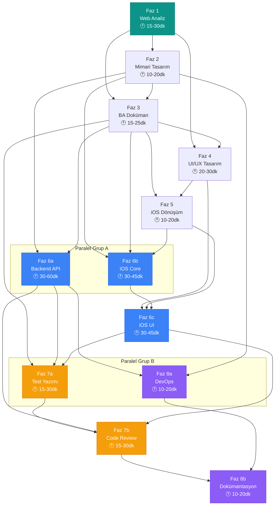

# Bağımlılık Haritası ve Paralellik Analizi

**Kaynak:** `~/ai-dev-team/pipeline/pipeline-config.md`
**Tarih:** 5 Mart 2026

---

## 1. Faz Giriş/Çıkış Haritası

| Faz | GİRDİ Dosyaları | ÇIKTI Dosyaları | Bağımlı Olduğu Fazlar |
|-----|-----------------|-----------------|------------------------|
| 1 | URL | `analysis/web-analysis-report.html` | — |
| 2 | `analysis/web-analysis-report.html` | `docs/architecture-decisions.md` | **1** |
| 3 | `analysis/web-analysis-report.html` + `docs/architecture-decisions.md` | `docs/ba-document.md` | **1, 2** |
| 4 | `analysis/web-analysis-report.html` + `docs/ba-document.md` | `design/components/` + `design/tokens.json` | **1, 3** |
| 5 | `design/components/` + `docs/ba-document.md` | `docs/ios-design-spec.md` | **3, 4** |
| 6a | `docs/architecture-decisions.md` + `docs/ba-document.md` | `backend/` | **2, 3** |
| 6b | `docs/architecture-decisions.md` + `docs/ios-design-spec.md` + `docs/ba-document.md` | `ios/` (core) | **2, 3, 5** |
| 6c | `docs/ios-design-spec.md` + `design/tokens.json` + `ios/` (core) | `ios/` (UI) | **4, 5, 6b** |
| 7a | `docs/ba-document.md` + `backend/` + `ios/` | `tests/` | **3, 6** |
| 7b | `backend/` + `ios/` + `tests/` + `docs/architecture-decisions.md` | `docs/code-review-report.html` | **2, 6, 7a** |
| 8a | `docs/architecture-decisions.md` + `backend/` | `infra/` | **2, 6a** |
| 8b | `docs/` + `backend/` + `ios/` + `infra/` | `README.md` + `docs/api-docs/` | **tümü** |

---

## 2. Bağımlılık Grafiği (Mermaid)



---

## 3. Faz Çifti Bağımlılık Matrisi

Bağımlı (→), bağımsız (—), aynı faz (=):

|   | F1 | F2 | F3 | F4 | F5 | F6a | F6b | F6c | F7a | F7b | F8a | F8b |
|---|----|----|----|----|----|----|-----|-----|-----|-----|-----|-----|
| **F1** | = | → | → | → | — | — | — | — | — | — | — | — |
| **F2** | | = | → | — | — | → | → | — | — | — | → | — |
| **F3** | | | = | → | → | → | → | — | → | — | — | — |
| **F4** | | | | = | → | — | — | → | — | — | — | — |
| **F5** | | | | | = | — | → | → | — | — | — | — |
| **F6a** | | | | | | = | — | — | → | → | → | — |
| **F6b** | | | | | | | = | → | — | — | — | — |
| **F6c** | | | | | | | | = | → | → | — | — |
| **F7a** | | | | | | | | | = | → | — | — |
| **F7b** | | | | | | | | | | = | — | → |
| **F8a** | | | | | | | | | | | = | → |
| **F8b** | | | | | | | | | | | | = |

**Okuma:** Satırdaki faz → sütundaki faza bağımlılık sağlar. Örn: F3 satırındaki → F6a = "Faz 6a, Faz 3'e bağımlı."

---

## 4. Paralel Çalışma Grupları

### Grup A: Backend ‖ iOS Core (Faz 6a ‖ Faz 6b)

| Parametre | Faz 6a (Backend) | Faz 6b (iOS Core) |
|-----------|------------------|-------------------|
| **Agent** | `backend-developer` | `swift-expert` |
| **Bağımlılıklar** | Faz 2 + Faz 3 | Faz 2 + Faz 3 + Faz 5 |
| **Başlama koşulu** | Faz 3 tamamlandığında | Faz 5 tamamlandığında |
| **Çıktı dizini** | `backend/` | `ios/` |
| **Worktree** | `worktrees/faz-6-backend-api/` | `worktrees/faz-6-ios-core/` |

**Paylaşılan dosyalar:** `docs/architecture-decisions.md`, `docs/ba-document.md` — **read-only**, conflict riski yok.

**Paralel çalışma koşulu:**
- Faz 6a, Faz 3 tamamlanınca başlayabilir (Faz 5'i beklemeye gerek yok)
- Faz 6b, Faz 5 tamamlanınca başlayabilir
- Eğer Faz 5 tamamlanmışsa → **ikisi aynı anda başlayabilir**
- Faz 6c (iOS UI), Faz 6b'ye bağımlı → paralel çalışamaz, 6b'den sonra sıralı

**Tahmini süre kazancı:**

| Senaryo | Sıralı Süre | Paralel Süre | Kazanç |
|---------|-------------|--------------|--------|
| Basit site | 6a (30dk) + 6b (30dk) + 6c (30dk) = **90dk** | max(6a, 6b) + 6c = 30 + 30 = **60dk** | **30dk (↓%33)** |
| Karmaşık site | 6a (60dk) + 6b (45dk) + 6c (45dk) = **150dk** | max(6a, 6b) + 6c = 60 + 45 = **105dk** | **45dk (↓%30)** |

---

### Grup B: Test Yazımı ‖ DevOps (Faz 7a ‖ Faz 8a)

| Parametre | Faz 7a (Test) | Faz 8a (DevOps) |
|-----------|---------------|-----------------|
| **Agent** | `test-automator` | `devops-engineer` |
| **Bağımlılıklar** | Faz 3 + Faz 6 (tümü) | Faz 2 + Faz 6a |
| **Başlama koşulu** | Faz 6c tamamlandığında | Faz 6a tamamlandığında |
| **Çıktı dizini** | `tests/` | `infra/` |
| **Worktree** | `worktrees/faz-7-tests/` | `worktrees/faz-8-deployment/` |

**Paylaşılan dosyalar:** `backend/` — **read-only**, conflict riski yok. DevOps yalnızca `infra/` dizinine yazar.

**Paralel çalışma koşulu:**
- Faz 8a sadece `backend/` kodunu ve `architecture-decisions.md`'yi okur → Faz 6a bitince başlayabilir
- iOS kodunu beklemesine gerek yok (Docker/CI sadece backend için)
- Faz 7a tüm kodu bekler (backend + iOS) → Faz 6c bitince başlar
- 8a, 6a bittikten hemen sonra paralel başlatılabilir (6b/6c devam ederken bile)

**Tahmini süre kazancı:**

| Senaryo | Sıralı Süre | Paralel Süre | Kazanç |
|---------|-------------|--------------|--------|
| Basit site | 7a (15dk) + 8a (10dk) = **25dk** | max(7a, 8a) = **15dk** | **10dk (↓%40)** |
| Karmaşık site | 7a (30dk) + 8a (20dk) = **50dk** | max(7a, 8a) = **30dk** | **20dk (↓%40)** |

> **Not:** Faz 8a aslında daha erken başlayabilir — Faz 6a bitince (6b/6c ile paralel). Bu 8a'yı zaman çizelgesinde çok öne çeker.

---

### Grup C: QA Backend ‖ QA iOS (Faz 7a içi paralellik)

| Parametre | QA Backend | QA iOS |
|-----------|------------|--------|
| **Agent** | `test-automator` (backend modunda) | `test-automator` (iOS modunda) |
| **Girdi** | `backend/` + `docs/ba-document.md` | `ios/` + `docs/ba-document.md` |
| **Çıktı** | `tests/backend/` | `tests/ios/` |
| **Worktree** | Aynı worktree: `worktrees/faz-7-tests/` | Aynı worktree |

**Paylaşılan dosyalar:** `docs/ba-document.md` — **read-only**. Çıktılar farklı alt dizinlere gider (`tests/backend/` vs `tests/ios/`), conflict riski yok.

**Paralel çalışma koşulu:**
- Her ikisi de Faz 6 tamamlandığında başlayabilir
- Aynı worktree'de çalışabilirler çünkü farklı dizinlere yazarlar
- Ancak aynı anda tek `test-automator` instance çalıştırılabilir ise → sıralı olmalı

**Tahmini süre kazancı:**

| Senaryo | Sıralı Süre | Paralel Süre | Kazanç |
|---------|-------------|--------------|--------|
| Basit site | Backend QA (10dk) + iOS QA (10dk) = **20dk** | max(10, 10) = **10dk** | **10dk (↓%50)** |
| Karmaşık site | Backend QA (20dk) + iOS QA (20dk) = **40dk** | max(20, 20) = **20dk** | **20dk (↓%50)** |

---

## 5. Optimum Zaman Çizelgesi

### Sıralı Yürütme (Worst Case)

```
F1 → F2 → F3 → F4 → F5 → F6a → F6b → F6c → F7a → F7b → F8a → F8b
```

| Senaryo | Toplam Süre |
|---------|-------------|
| Basit site | 15+10+15+20+10+30+30+30+15+15+10+10 = **210 dk (3.5 saat)** |
| Orta | 22+15+20+25+15+45+37+37+22+22+15+15 = **290 dk (4.8 saat)** |
| Karmaşık | 30+20+25+30+20+60+45+45+30+30+20+20 = **375 dk (6.3 saat)** |

### Paralel Yürütme (Optimum)

```
ZAMAN →
─────────────────────────────────────────────────────
[F1] → [F2] → [F3] → [F4] → [F5] ─┬→ [F6a] ─────┬→ [F7a] → [F7b] → [F8b]
                                     └→ [F6b] → [F6c]─┘       ↑
                                     │                    [F8a]─┘
                                     └→ [F8a (erken)] ────┘
─────────────────────────────────────────────────────
```

**Kritik yol:** F1 → F2 → F3 → F4 → F5 → F6b → F6c → F7a → F7b → F8b

| Senaryo | Kritik Yol Süresi | Sıralı Süre | Kazanç |
|---------|-------------------|-------------|--------|
| Basit site | 15+10+15+20+10+30+30+15+15+10 = **170 dk (2.8 saat)** | 210 dk | **40 dk (↓%19)** |
| Orta | 22+15+20+25+15+37+37+22+22+15 = **230 dk (3.8 saat)** | 290 dk | **60 dk (↓%21)** |
| Karmaşık | 30+20+25+30+20+45+45+30+30+20 = **295 dk (4.9 saat)** | 375 dk | **80 dk (↓%21)** |

---

## 6. Conflict Risk Haritası

| Paralel Çift | Paylaşılan Dosya | Yazma Çakışma? | Risk |
|-------------|-------------------|----------------|------|
| F6a ‖ F6b | `docs/architecture-decisions.md` | Hayır (read-only) | 🟢 Yok |
| F6a ‖ F6b | `docs/ba-document.md` | Hayır (read-only) | 🟢 Yok |
| F6a ‖ F6c | — | Farklı dizinler (`backend/` vs `ios/`) | 🟢 Yok |
| F7a ‖ F8a | `backend/` | Hayır (read-only) | 🟢 Yok |
| F7a(be) ‖ F7a(ios) | `docs/ba-document.md` | Hayır (read-only) | 🟢 Yok |
| F7b ‖ F8b | `docs/` | F8b yazar, F7b okur — **sıralama gerekli** | 🟡 Düşük |

> **Sonuç:** Worktree isolation kullanıldığında conflict riski **sıfır**. Her subagent kendi worktree'sinde çalışır, develop'a merge öncesi pre-merge-check yapılır.

---

## 7. Özet

| Metrik | Değer |
|--------|-------|
| Toplam faz | 8 (12 alt görev) |
| Paralel çalışabilir grup | **3** |
| Sıralı yürütme (orta site) | ~290 dk |
| Paralel yürütme (orta site) | ~230 dk |
| **Toplam kazanç** | **~60 dk (↓%21)** |
| Conflict riski | **Sıfır** (worktree isolation ile) |
| Kritik yol | F1→F2→F3→F4→F5→F6b→F6c→F7a→F7b→F8b |
