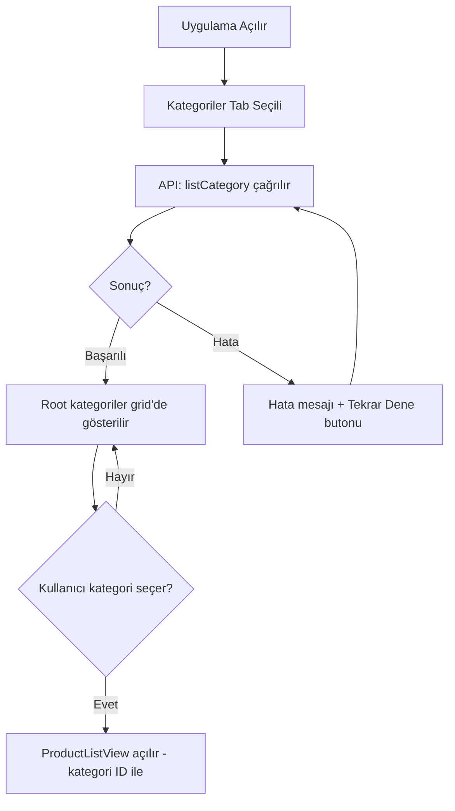
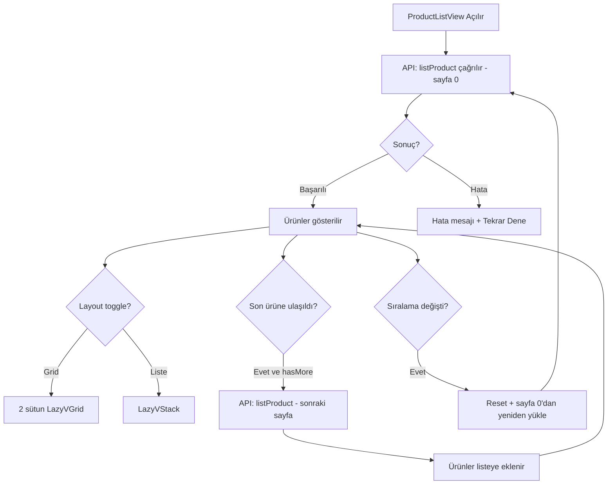

# ProteinOcean iOS — İş Analizi Dokümanı

**Tarih:** 2026-03-05
**Agent:** ba-doc-generator (retrospektif)
**Kaynak:** analysis/web-analysis.md + mevcut iOS implementasyonu

---

## KAPSAM

Bu doküman yalnızca belirlenen kapsam dahilindeki modülleri kapsar:

1. Kategori Listesi — Ana kategori görüntüleme ekranı
2. Ürün Listeleme — Kategori bazlı ürün grid/liste görünümü
3. Filtreleme ve Sıralama UI
4. Ürün Kartı bileşeni

**Kapsam Dışı:** Sepet, ödeme, kullanıcı girişi, ürün detay (tam), blog, promosyon sayfaları.

---

## MODÜL 1: KATEGORİ LİSTESİ

### Açıklama
Kullanıcının ProteinOcean ürün kategorilerini grid görünümünde görüp seçebildiği ana ekran.

### İş Akışı

### Fonksiyonel Gereksinimler

**FR-001:** Sistem, uygulama açıldığında ikas API'sinden aktif kategorileri çekmelidir.

**FR-002:** Kategoriler 2 sütunlu grid düzeninde gösterilmelidir.

**FR-003:** Her kategori kartı; kategori adı, görseli (varsa) ve ürün sayısını içermelidir.

**FR-004:** Kategori görseli yoksa emoji bazlı placeholder gösterilmelidir (protein→💪, vitamin→💊, gıda→🥗, aksesuar→🎽, sağlık→❤️, diğer→🛒).

**FR-005:** Sadece root (üst) kategoriler listelenmeli, alt kategoriler doğrudan gösterilmemelidir.

**FR-006:** Kullanıcı bir kategoriye tıkladığında, o kategoriye ait ürün listesi ekranına geçilmelidir.

### İş Kuralları

**BR-001:** `parentId == nil` olan kategoriler root kabul edilir.

**BR-002:** Kategori ürün sayısı ikas API'sinden `productCount` alanıyla gelir; bu değer yoksa sayı gösterilmez.

**BR-003:** Kategori görsel URL'si `cdn.myikas.com` üzerinden sunulur.

### Kabul Kriterleri

**AC-001:** API başarılı döndüğünde ≥1 kategori grid'de görünür.

**AC-002:** API hatası durumunda "Tekrar Dene" butonu görünür ve tıklandığında yeniden çağrı yapılır.

**AC-003:** Kategoriye tıklandığında başlık o kategorinin adı olan ürün listesi ekranı açılır.

**AC-004:** Kategori görseli yüklenirken skeleton/placeholder gösterilir.

### Validasyonlar

**VAL-001:** Boş kategori listesi → kullanıcıya bilgi mesajı gösterilir (hata değil).

---

## MODÜL 2: ÜRÜN LİSTELEME

### Açıklama
Seçilen kategorideki ürünlerin grid veya liste görünümünde, sıralama seçeneğiyle görüntülendiği ekran. Sonsuz kaydırma ile pagination destekler.

### İş Akışı

### Fonksiyonel Gereksinimler

**FR-007:** Ürünler 24'lük sayfalarda yüklenmeli, son ürüne ulaşıldığında sonraki sayfa otomatik yüklenmeli (infinite scroll).

**FR-008:** Kullanıcı grid (2 sütun) ve liste görünümü arasında geçiş yapabilmelidir.

**FR-009:** Sıralama seçenekleri: En Çok Satan, En Yeni, Fiyat Düşükten Yükseğe, Fiyat Yüksekten Düşüğe.

**FR-010:** Sıralama değiştiğinde ürün listesi sıfırlanıp yeniden yüklenmeli.

**FR-011:** Her ürün kartı, kategori ID'sine göre filtrelenmiş ürünleri göstermelidir.

**FR-012:** Tüm Ürünler sekmesinde categoryId filtresi olmaksızın tüm ürünler listelenmeli.

### İş Kuralları

**BR-004:** Pagination: `page * 24` offset ile ikas API'sine gönderilir.

**BR-005:** `result.count < 24` ise `hasMore = false`, yeni sayfa yüklenmez.

**BR-006:** Sıralama ikas API `sort.type` parametresiyle gönderilir: `BEST_SELLER | LAST_ADDED | PRICE_ASC | PRICE_DESC`.

**BR-007:** Ürün stok sayısı 0 ise "Stokta Yok" badge'i gösterilir.

**BR-008:** `buyPrice > sellPrice` ise indirim yüzdesi hesaplanır: `((buyPrice - sellPrice) / buyPrice) * 100`.

### Kabul Kriterleri

**AC-005:** Grid ve liste görünümü arasında geçiş animasyonlu (`withAnimation`) çalışır.

**AC-006:** Sıralama değiştiğinde liste sıfırlanır ve ilk sayfa yeniden yüklenir.

**AC-007:** Son ürüne scroll edildiğinde `ProgressView` gösterilir ve sonraki sayfa yüklenir.

**AC-008:** `hasMore = false` durumunda ek yükleme yapılmaz.

**AC-009:** Loading state'inde `ProgressView` merkezi olarak gösterilir.

### Validasyonlar

**VAL-002:** Boş ürün listesi → kullanıcıya bilgi mesajı gösterilir.

**VAL-003:** Eş zamanlı yükleme koruması: `isLoading` veya `isLoadingMore` true iken yeni istek başlatılmaz.

---

## MODÜL 3: ÜRÜN KARTI

### Açıklama
Hem grid hem de liste görünümünde kullanılan tekrar kullanılabilir ürün kartı bileşeni.

### Fonksiyonel Gereksinimler

**FR-013:** Grid kartı: Ürün görseli (üst, sabit yükseklik 160pt), ürün adı (max 2 satır), satış fiyatı.

**FR-014:** Liste kartı: Küçük görsel (90x90pt), ürün adı (max 3 satır), marka adı, fiyat, stok durumu.

**FR-015:** İndirimli ürünlerde: satış fiyatı + üstü çizili orijinal fiyat + kırmızı indirim badge'i (`%-XX`).

**FR-016:** Görsel `cdn.myikas.com/images/[fileName]` URL'sinden `AsyncImage` ile yüklenmeli.

**FR-017:** Görsel yüklenemezse gri placeholder gösterilmeli.

### İş Kuralları

**BR-009:** `sellPrice` ikas API `variants[0].price.sellPrice` alanından alınır.

**BR-010:** `originalPrice` ikas API `variants[0].price.buyPrice` alanından alınır.

**BR-011:** Fiyat `TRY` para birimi ile formatlanır: `formatted(.currency(code: "TRY"))`.

**BR-012:** Ana görsel `imageList` dizisindeki ilk eleman kabul edilir.

### Kabul Kriterleri

**AC-010:** İndirimli üründe hem satış fiyatı hem üstü çizili orijinal fiyat görünür.

**AC-011:** Stokta olmayan üründe "Stokta Yok" badge'i turuncu renkte gösterilir (sadece liste görünümünde).

**AC-012:** Görsel yüklenirken `ProgressView` gösterilir.

**AC-013:** Görsel yüklenemezse `Image(systemName: "photo")` placeholder gösterilir.

**AC-014:** Kart gölge efekti ile yüzeyden hafif yükseltilmiş görünür (shadow radius: 5).

### Validasyonlar

**VAL-004:** `variants` dizisi boş ise fiyat gösterilmez.

**VAL-005:** Negatif stok değeri stokta yok olarak değerlendirilir (`stockCount ?? 0 > 0`).

---

## MODÜL 4: NAVIGASYON VE TAB BAR

### Fonksiyonel Gereksinimler

**FR-018:** Ana navigasyon `TabView` ile sağlanmalı: "Kategoriler" ve "Ürünler" sekmeleri.

**FR-019:** Kategoriler sekmesi: `square.grid.2x2` SF Symbol ikonu.

**FR-020:** Ürünler sekmesi: `bag` SF Symbol ikonu, tüm ürünleri listeler (categoryId = nil).

**FR-021:** Kategori seçiminde `NavigationStack` + `NavigationLink` ile Ürün Listesi ekranına geçiş.

### Kabul Kriterleri

**AC-015:** Uygulamada ilk açılışta Kategoriler sekmesi aktif gelir.

**AC-016:** Tab değişiminde önceki sekmenin scroll pozisyonu korunur.

---

## GEREKSİNİM İZLEME MATRİSİ

| Gereksinim | Tip | Öncelik | iOS Dosya |
|------------|-----|---------|-----------|
| FR-001 | Fonksiyonel | Kritik | CategoriesViewModel.swift |
| FR-002 | Fonksiyonel | Yüksek | CategoriesView.swift |
| FR-003 | Fonksiyonel | Yüksek | CategoriesView.swift (StoreCategoryCard) |
| FR-007 | Fonksiyonel | Kritik | ProductListViewModel.swift |
| FR-009 | Fonksiyonel | Yüksek | ProductListView.swift |
| FR-013–017 | Fonksiyonel | Yüksek | ProductListView.swift (ProductCard) |
| BR-008 | İş Kuralı | Orta | Product.swift (discountPercent) |
| AC-006 | Kabul | Kritik | ProductListViewModel.swift (setSort) |
