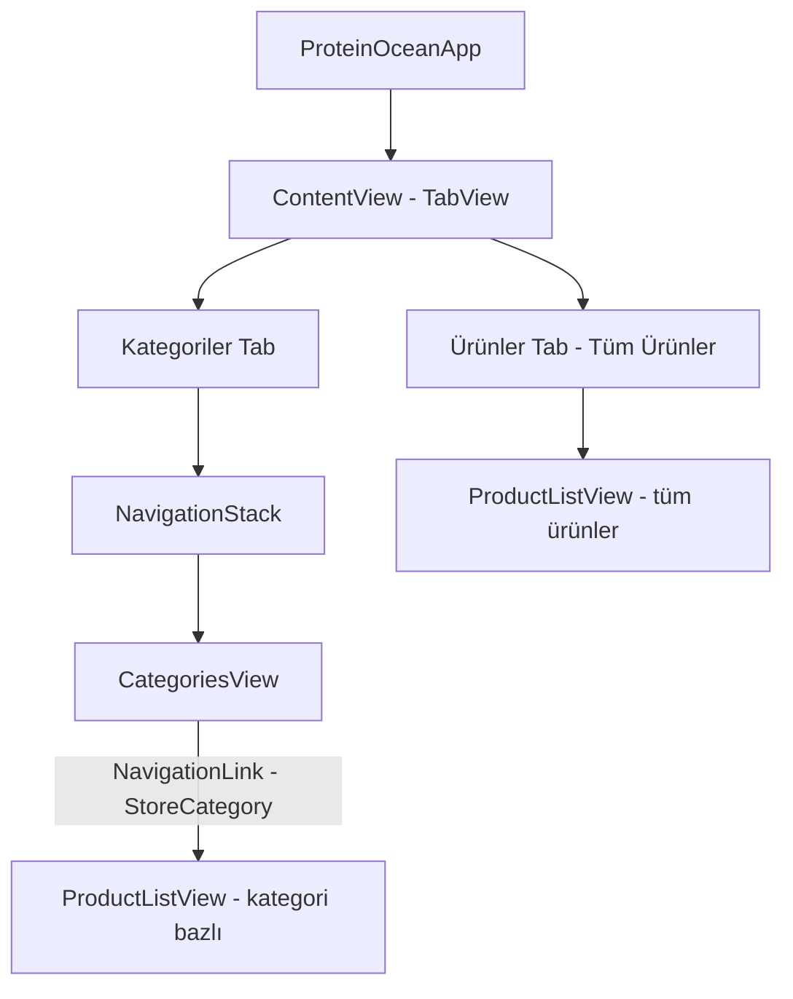

# ProteinOcean iOS — Tasarım Spesifikasyonu

**Tarih:** 2026-03-05
**Agent:** uiux-translator (retrospektif — mevcut SwiftUI implementasyonundan çıkarılmıştır)

---

## 1. NAVIGASYON HARİTASI



### Tab Bar Yapısı

| Tab | İkon (SF Symbol) | View | Başlık |
|-----|-----------------|------|--------|
| 0 — Varsayılan | `square.grid.2x2` | CategoriesView | Kategoriler |
| 1 | `bag` | ProductListView(categoryId: nil) | Tüm Ürünler |

---

## 2. EKRAN LİSTESİ

| Ekran | SwiftUI View | ViewModel | Navigasyon |
|-------|-------------|-----------|------------|
| Kategori Grid | `CategoriesView` | `CategoriesViewModel` | Tab root |
| Ürün Listesi | `ProductListView` | `ProductListViewModel` | Tab root + Nav push |

---

## 3. COMPONENT HİYERARŞİSİ

```
ContentView (TabView)
├── CategoriesView (NavigationStack)
│   ├── LazyVGrid [2 sütun]
│   │   └── StoreCategoryCard × N
│   │       ├── AsyncImage / StoreCategoryPlaceholderImage
│   │       └── VStack [name, productCount]
│   └── NavigationDestination → ProductListView
│
└── ProductListView
    ├── Toolbar HStack
    │   ├── Button [Sıralama] → confirmationDialog
    │   └── Button [Layout Toggle] → grid/list
    ├── ProgressView (loading)
    ├── ErrorView (error)
    └── ScrollView
        ├── LazyVGrid [2×] → ProductCard(isGrid: true) × N
        └── LazyVStack → ProductCard(isGrid: false) × N
```

---

## 4. TASARIM TOKEN'LARI

> **Not:** Brand token analizi (Faz 1.5) henüz tamamlanmadığından bu değerler mevcut implementasyondan çıkarılmıştır. `brand-tokens.json` tamamlandığında güncellenecektir.

### Renkler

| Token | SwiftUI Değer | Kullanım |
|-------|--------------|---------|
| `primary` | `.blue` (geçici) | Fiyat, tint, CTA |
| `background.card` | `Color(.systemBackground)` | Kart arka planı |
| `background.page` | `Color(.systemGroupedBackground)` | Toolbar arka planı |
| `placeholder.light` | `Color(.systemGray5)` | Görsel placeholder |
| `placeholder.medium` | `Color(.systemGray6)` | Görsel loading |
| `error` | `.orange` | Stokta yok badge |
| `discount` | `.red` | İndirim badge |
| `category.placeholder.bg` | `Color.blue.opacity(0.08)` (geçici) | Kategori placeholder |

**Geçici değerler** (`brand-tokens.json` sonrası güncellenecek):
- `.blue` → ProteinOcean primary rengi ile değiştirilmeli
- `Color.blue.opacity(0.08)` → primary rengi ile değiştirilmeli

### Tipografi

| Kullanım | SwiftUI Font | Ağırlık |
|----------|-------------|---------|
| Fiyat (büyük) | `.headline` | `.bold` |
| Ürün adı | `.subheadline` | default |
| Marka adı | `.caption` | default |
| İndirim badge | `.caption2` | `.bold` |
| Stok badge | `.caption2` | default |
| Ürün sayısı | `.caption` | default |
| Kategori adı | `.subheadline` | `.semibold` |

### Spacing

| Bileşen | Değer |
|---------|-------|
| Grid sütun arası | 12pt |
| Grid satır arası | 12pt (default) |
| Kategori grid arası | 16pt |
| Kart iç padding (grid) | 10pt |
| Kart iç padding (liste) | 12pt |
| HStack elemanlar arası | 12pt (liste kartı) |
| Fiyat elemanlar arası | 2pt |

### Border Radius

| Bileşen | Değer |
|---------|-------|
| Ürün kartı | 12pt |
| Liste görsel | 10pt |
| İndirim badge | 6pt |
| Stok badge | Capsule() |

### Shadow

| Bileşen | radius | x | y | opacity |
|---------|--------|---|---|---------|
| Ürün kartı (grid) | 5 | 0 | 2 | 0.07 |
| Ürün kartı (liste) | 5 | 0 | 2 | 0.07 |
| Kategori kartı | 6 | 0 | 2 | 0.08 |

---

## 5. BILEŞEN DETAYLARI

### StoreCategoryCard

```swift
VStack(spacing: 0) {
    AsyncImage(url:) // height: 120, .fill
        placeholder: StoreCategoryPlaceholderImage
    VStack(alignment: .leading, spacing: 4) {
        Text(name)        // .subheadline .semibold, lineLimit: 2
        Text(productCount)// .caption .secondary (opsiyonel)
    }
    .padding(12)
}
.background(.systemBackground)
.clipShape(RoundedRectangle(cornerRadius: 12))
.shadow(color: .black.opacity(0.08), radius: 6, y: 2)
```

### ProductCard (Grid)

```swift
VStack(alignment: .leading, spacing: 0) {
    AsyncImage // height: 160, .fill
    VStack(alignment: .leading, spacing: 6) {
        Text(name)      // .subheadline, lineLimit: 2
        PriceView       // sellPrice + strikethrough originalPrice
    }
    .padding(10)
}
.background(.systemBackground)
.clipShape(RoundedRectangle(cornerRadius: 12))
.shadow(...)
.overlay(alignment: .topTrailing) { DiscountBadge }
```

### ProductCard (Liste)

```swift
HStack(spacing: 12) {
    AsyncImage // 90×90, cornerRadius: 10
    VStack(alignment: .leading, spacing: 6) {
        Text(name)    // .subheadline, lineLimit: 3
        Text(brand)   // .caption .secondary
        PriceView
        StockBadge
    }
}
.padding(12)
.background(.systemBackground)
.clipShape(RoundedRectangle(cornerRadius: 12))
```

### ErrorView

```swift
VStack(spacing: 16) {
    Image(systemName: "exclamationmark.triangle") // size: 44, .orange
    Text(message) // .secondary, multilineTextAlignment: .center
    Button("Tekrar Dene") // .borderedProminent
}
```

---

## 6. iOS-SPECIFIC PATTERNS

| Pattern | Uygulama |
|---------|---------|
| Pull-to-refresh | Henüz implemente edilmedi (FR eksik) |
| Haptic feedback | Henüz implemente edilmedi |
| Dark mode | `Color(.systemBackground)` ile otomatik destek var |
| Dynamic Type | `.subheadline`, `.caption` → Dynamic Type uyumlu |
| VoiceOver | Accessibility label'ları eksik — iyileştirme gerekli |

---

## 7. EKSİK / İYİLEŞTİRME GEREKTİREN NOKTALAR

| Sorun | Öncelik | Açıklama |
|-------|---------|---------|
| Hardcoded `.blue` renk | Yüksek | Brand token geldiğinde custom Color'a taşınmalı |
| VoiceOver label'ları | Orta | Ürün kartları için `.accessibilityLabel` eklenmeli |
| Pull-to-refresh | Orta | `.refreshable` modifier ile eklenebilir |
| Ürün detay ekranı | Düşük | Kapsam dışı ancak boş NavigationLink sorun yaratır |
| Typo: "urun" | Kritik | CategoriesView.swift:73 — `"\(count) urun"` → `"\(count) ürün"` |
